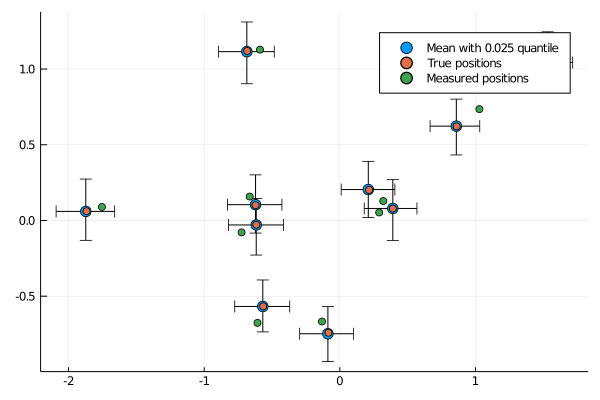

# EuclideanDistanceMatrices

[](https://github.com/baggepinnen/EuclideanDistanceMatrices.jl/actions)
[](https://codecov.io/gh/baggepinnen/EuclideanDistanceMatrices.jl)

Utilities for working with matrices of squared Euclidean distances.

- `D̃ = complete_distmat(D, W)`: Fills in missing entries in an incomplete and noisy distance matrix. `W` is a binary mask indicating available values.
- `P = reconstruct_pointset(D, dim)` Takes a squared distance matrix or the SVD of one and reconstructs the set of points embedded in dimension `dim` that generated `D`; up to a translation and rotation/reflection. See `procrustes` for help with aligning the result to a collection of anchors.
- `R,t = procrustes(X, Y)` Find rotation matrix `R` and translation vector `t` such that `R*X .+ t ≈ Y`
- `denoise_distmat(D, dim, p=2)` Takes a noisy squared distance matrix and returns a denoised version. `p` denotes the "norm" used in measuring the error. `p=2` assumes that the error is Gaussian, whereas `p=1` assumes that the error is large but sparse.
- `posterior` Estimate the posterior distribution of locations given both noisy location measurements and distance measurements, see more details below.


## Bayesian estimation of locations
If both noisy position estimates and noisy distance measurements are available, we can estimate the full Bayesian posterior over positions. To this end, the function `psoterior` is avialable. We demonstrate how it's used with an example, and start by generating some sythetic data:
```julia
N = 10    # Number of points
σL = 0.1  # Location noise std
σD = 0.1  # Distance noise std

P = randn(2,N) # These are the true locations
Pn = P + σL*randn(size(P)) # Noisy locations
D = pairwise(SqEuclidean(), P, dims=2) # True distance matrix
Dn = D + σD*randn(size(D)) # Noisy distance matrix
Dn[diagind(Dn)] .= 0 # The diagonal is always 0

# We select a small number of distances to feed the algorithm, this corresponds to only some distances between points being measured
distances = []
p = 0.3 # probability of including a distance
for i = 1:N
    for j = i+1:N-1
        rand() < p || continue
        push!(distances, (i,j,Dn[i,j]))
    end
end
@show length(distances)
@show expected_number_of_entries = p*(N^2-N)÷2
```


Given the locations `P` and `distances` (vctor of tuples with indices and distances), we can now estimate the posterior:
```julia
part, chain = posterior(
    Pn,
    distances;
    nsamples = 2000,
    sampler = NUTS(),
    σL = σL,
    σD = σD
)
```
The returned object `part` is a named tuple containing all the internal variables that were sampled. The fields are of type `Particles` from [MonteCarloMeasurements.jl](https://github.com/baggepinnen/MonteCarloMeasurements.jl), representing the full posterior distribution of each quantity. The interesting fields are `part.P` which contains the posterior positions, and `part.de` which contains the estimated errors in the distance measurements. The object `chain` contains the same information as `part`, but in the form of a `Turing.Chain` object.


We can verify that the estimated locations are closer to the true locations than the ones provided by the measurements alone, and plot the results
```julia
norm(mean.(part.P) - P) < norm(Pn - P)

scatter(part.P[1,:], part.P[2,:], markersize=6)
scatter!(P[1,:], P[2,:], lab="True positions")
scatter!(Pn[1,:], Pn[2,:], lab="Measured positions")
```



Under the hood, [Turing.jl](https://turing.ml/dev/) is used to sample from the posterior. If you have a lot of points, it will take a while to run this function. If the sampling takes too long time, you may try estimating an MAP estimate instead. To do this, run `using Optim` and then pass `sampler = MAP`. More docs on MAP estimation is found [here](https://turing.ml/dev/docs/using-turing/guide#maximum-likelihood-and-maximum-a-posterior-estimates).


## Installation
```julia
using Pkg
pkg"add https://github.com/baggepinnen/EuclideanDistanceMatrices.jl"
pkg"build EuclideanDistanceMatrices"
```
