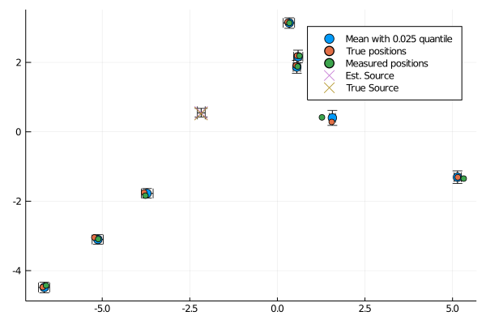

# EuclideanDistanceMatrices

[](https://github.com/baggepinnen/EuclideanDistanceMatrices.jl/actions)
[](https://codecov.io/gh/baggepinnen/EuclideanDistanceMatrices.jl)

Utilities for working with matrices of squared Euclidean distances.

- `D̃ = complete_distmat(D, W)`: Fills in missing entries in an incomplete and noisy squared distance matrix. `W` is a binary mask indicating available values. (Algorithm 5 from the reference below).
- `P = reconstruct_pointset(D, dim)` Takes a squared distance matrix or the SVD of one and reconstructs the set of points embedded in dimension `dim` that generated `D`; up to a translation and rotation/reflection. See `procrustes` for help with aligning the result to a collection of anchors.
- `R,t = procrustes(X, Y)` Find rotation matrix `R` and translation vector `t` such that `R*X .+ t ≈ Y`
- `denoise_distmat(D, dim, p=2)` Takes a noisy squared distance matrix and returns a denoised version. `p` denotes the "norm" used in measuring the error. `p=2` assumes that the error is Gaussian, whereas `p=1` assumes that the error is large but sparse. The robust factorization comes from [TotalLeastSquares.jl](https://github.com/baggepinnen/TotalLeastSquares.jl/).
- `posterior` Estimate the posterior distribution of locations given both noisy location measurements and distance measurements (not squared), see more details below.


## Bayesian estimation of locations
### With distance measurements
If both noisy position estimates and noisy distance measurements are available, we can estimate the full Bayesian posterior over positions. To this end, the function `psoterior` is avialable. We demonstrate how it's used with an example, and start by generating some sythetic data:
```julia
using EuclideanDistanceMatrices, Turing
N = 10    # Number of points
σL = 0.1  # Location noise std
σD = 0.01 # Distance noise std (measured in the same unit as positions)

P  = randn(2,N)                       # These are the true locations
Pn = P + σL*randn(size(P))            # Noisy locations
D  = pairwise(Euclidean(), P, dims=2) # True distance matrix (this function exoects distances, not squared distances).
Dn = D + σD*randn(size(D))            # Noisy distance matrix
Dn[diagind(Dn)] .= 0 # The diagonal is always 0

# We select a small number of distances to feed the algorithm, this corresponds to only some distances between points being measured
distances = []
p = 0.5 # probability of including a distance
for i = 1:N
    for j = i+1:N
        rand() < p || continue
        push!(distances, (i,j,Dn[i,j]))
    end
end
@show length(distances)
@show expected_number_of_entries = p*((N^2-N)÷2)
```

Given the locations `P` and `distances` (vector of tuples with indices and distances), we can now estimate the posterior:
```julia
part, chain = posterior(
    Pn,
    distances;
    nsamples = 2000,
    sampler = NUTS(),
    σL = σL, # This can also be a vector of std:s for each location, see ?MvNormal for alternatives
    σD = σD  # This can also be a vector of std:s for each location, see ?MvNormal for alternatives
)
```
The returned object `part` is a named tuple containing all the internal variables that were sampled. The fields are of type `Particles` from [MonteCarloMeasurements.jl](https://github.com/baggepinnen/MonteCarloMeasurements.jl), representing the full posterior distribution of each quantity. The interesting fields are `part.P` which contains the posterior positions, and `part.d` which contains the estimated distances. The object `chain` contains the same information as `part`, but in the form of a `Turing.Chain` object.

Note that the number of samples in the posterior will not be the same as the number requested by `nsamples` since Turing automatically drops bad samples etc. 


We can verify that the estimated locations are closer to the true locations than the ones provided by the measurements alone, and plot the results
```julia
norm(mean.(part.P) - P) < norm(Pn - P)

scatter(part.P[1,:], part.P[2,:], markersize=6)
scatter!(P[1,:], P[2,:], lab="True positions")
scatter!(Pn[1,:], Pn[2,:], lab="Measured positions")
```


Under the hood, [Turing.jl](https://turing.ml/dev/) is used to sample from the posterior. If you have a lot of points, it will take a while to run this function. If the sampling takes too long time, you may try estimating an MAP estimate instead. To do this, run `using Optim` and then pass `sampler = MAP()`. More docs on MAP estimation is found [here](https://turing.ml/dev/docs/using-turing/guide#maximum-likelihood-and-maximum-a-posterior-estimates).


### With TDOA measurements (time difference of arrival, i.e., differences of distances)
In this setting, we add one location in the matrix of locations, corresponding to the location of the source that generated the ping.
We then set the keyword `tdoa=true` when calling `posterior`, and let the vector of `(i, j, dist)` instead be `(i,j,tdoa)`. Below is a similar example to the one above, but adapted to this setting.
```julia
N      = 10                      # Number of points
# The standard deviations below can also be supplied as vectors with one element per location
σL     = 0.1                     # Location noise std
σD     = 0.01                    # TDOA noise std (measured in the same unit as positions)
P      = 3randn(2, N)            # These are the true locations
source = randn(2)                # The true source location
Pn     = P + σL * randn(size(P)) # Noisy locations
tdoas  = []
noisy_tdoas = []
p = 0.5 # probability of including a TDOA
for i = 1:N
    for j = i+1:N
        if rand() < p
            di = norm(P[:, i] - source) # Distance from source to i
            dj = norm(P[:, j] - source) # Distance from source to j
            tdoa = di - dj              # This is the predicted TDOA given the posterior locations
            push!(tdoas, (i, j, tdoa))
            push!(noisy_tdoas, (i, j, tdoa + σD * randn()))
        end
    end
end
@show length(tdoas)
@show expected = p * ((N^2 - N) ÷ 2)


part, chain = posterior(
    [Pn source], # We add the source location to the end of this matrix
    noisy_tdoas;
    nsamples = 2000,
    sampler  = NUTS(),
    σL       = σL,
    σD       = σD, # This can also be a vector of std:s for each location, see ?MvNormal for alternatives
    tdoa     = true, # Indicating that we are providing TDOA measurements
)

norm(mean.(part.P[:, 1:end-1]) - P) < norm(Pn - P)
```
Once again, we visualize the resulting estimate
```julia
scatter(part.P[1, 1:end-1], part.P[2, 1:end-1], markersize = 6)
scatter!(P[1, :],  P[2, :],  lab = "True positions")
scatter!(Pn[1, :], Pn[2, :], lab = "Measured positions")
scatter!(
    [part.P[1, end]],
    [part.P[2, end]],
    m = (:x, 8),
    lab = "Est. Source",
)
scatter!([source[1]], [source[2]], m = (:x, 8), lab = "True Source") |> display
```



### Relative vs. Absolute estimates
The function `posterior` estimates the *absolute* positions of the sensors in the coordinate system used to provide the location measurements. Oftentimes, the relative positions between the sensors are sufficient, and are also easier to estimate. Estimates of the relative positions are available in the resulting samples from the posterior distribution, but hidden within the samples. If we draw 2000 samples from the posterior, the absolute coordinates of each sample can be aligned to the mean of all samples (using `procrustes`), after which 2000 samples of the relative positions are available. This relative estimate will have lower variance than the absolute estimate. To facilitate this alignment, we have the function
```julia
P_relative = align_to_mean(part.P)
tr(cov(vec(part.P))) > tr(cov(vec(P_relative))) # Test that the covariance matrix is "smaller"
```


## Installation
```julia
using Pkg
pkg"add https://github.com/baggepinnen/EuclideanDistanceMatrices.jl"
```


### References
Most of the algorithms implemented in this package are described in the excellent paper
"Euclidean Distance Matrices: Essential Theory, Algorithms and Applications"
Ivan Dokmanic, Reza Parhizkar, Juri Ranieri and Martin Vetterli  
https://arxiv.org/pdf/1502.07541.pdf
